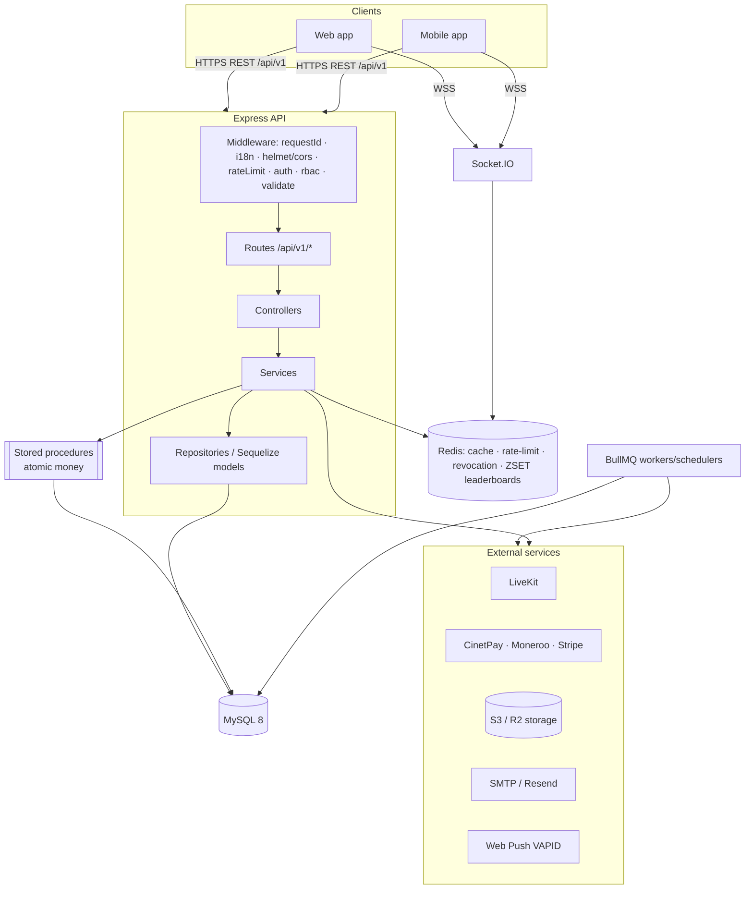
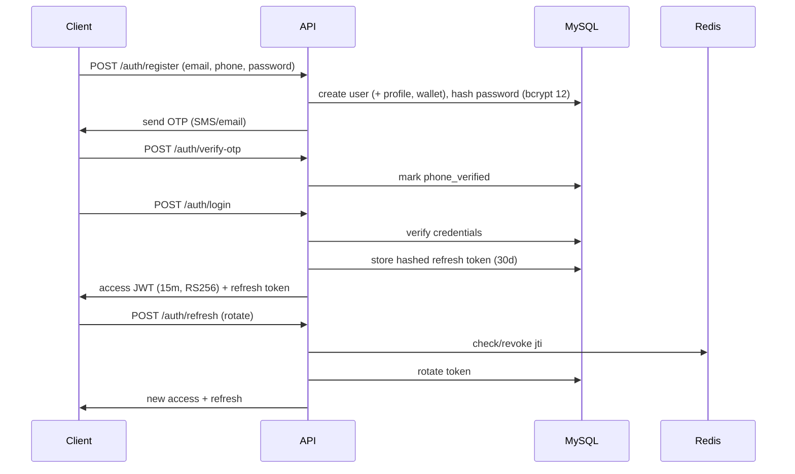
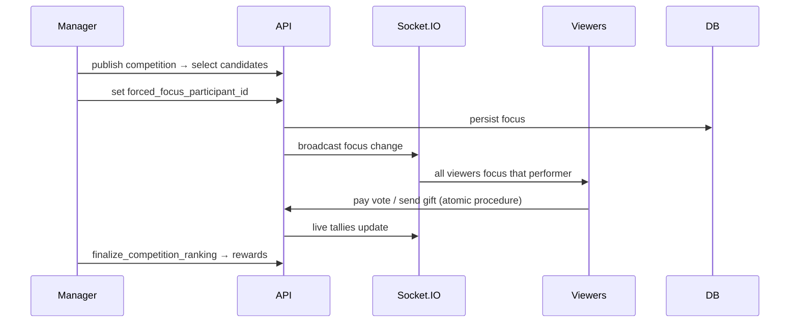

# Architecture

Clean, layered architecture: **route → validate → controller → service →
repository/model → MySQL**. Controllers stay thin (no business logic); no
Sequelize query lives outside a service/repository.

## Module map



## Auth flow



## Payment flow (recharge)

```mermaid
sequenceDiagram
  participant C as Client
  participant A as API
  participant P as Provider (CinetPay/Moneroo/Stripe)
  participant DB as MySQL
  C->>A: POST /payments/{provider}/init (Idempotency-Key)
  A->>DB: create pending credit_purchase (merchant_transaction_id)
  A->>P: init transaction
  P-->>A: payment URL / token
  A-->>C: redirect/checkout URL
  P->>A: webhook (signed)
  A->>A: verify HMAC + timestamp; check webhook_events idempotency
  A->>DB: CALL credit_wallet(...) atomically; mark purchase paid
  A-->>P: 200 OK
```

## Competition live flow


